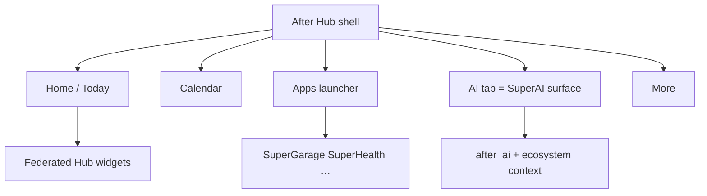
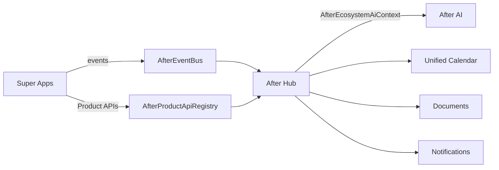

# After Hub — Consumer Digital OS shell

**Version:** 1.0  
**Status:** H2 scaffold (Calendar + Apps tabs; Garage/Health/Find widget adapters)  
**ADR:** [`adr/ADR-019-after-hub.md`](adr/ADR-019-after-hub.md)  
**Companions:** Master Vision v2.0 · Manifest · `LIFE_DOMAINS.md` · Dashboard Engine · Plugin System

---

## Positioning

**After Hub is not a Super App / Life Domain.** It is the **consumer OS shell** —
the front door to the AfterArtificial Digital OS.

| Layer | Role |
|-------|------|
| **After Hub** | Entry product: identity, dashboard, AI, calendar, documents, notifications, family, search, settings, After+ |
| **Super** apps | Life Domain modules; deep UX when needed; **must** expose Hub widgets + events |
| **SuperAI** | **Subsumed into Hub** as the permanent AI surface (no competing entry app). Catalog keeps `SuperAI` as capability branding only |
| **after_ecosystem / after_core / after_ai** | Shared fabric Hub mounts; Hub does not reimplement calendar/search/docs/AI |

Admission filter does **not** apply as “another Super…” — Hub is platform UX,
analogous to iOS Home + Control Center + Spotlight + Siri in one product.

```
AfterArtificial Digital OS
  └── After Hub          ← users enter here
        ├── SuperGarage, SuperHealth, SuperKids, … (modules + widgets)
        └── Powered by After Framework / Built by Overstein Labs
```

Users navigate **domains of one OS**. Hub is that navigation surface.

---

## Product vision

Mission: the world’s most intelligent **personal dashboard** — one identity,
one AI, one subscription, one dashboard, one ecosystem. Users rarely open
individual Super Apps for routine life; they manage life from Hub and dive into
a module only for deep domain work.

Design: premium, minimal, AI-first; light/dark; accessible; fast; responsive
(phone / tablet / web later).

---

## Information architecture

### Primary nav (5 + more)

| Tab | Purpose |
|-----|---------|
| **Home** | Today’s Summary, briefing, AI insights, quick actions, favorites, weather, cross-app recommendations |
| **Calendar** | Unified merged calendar |
| **Apps** | Super App launcher + installed module grid (widgets preview) |
| **AI** | Permanent After AI (full-screen Mate) — *this is the SuperAI surface* |
| **More** | Documents, Notifications inbox, Family, Search, Settings, After+, Profile |

Secondary (from More / Home tiles): Document Center, Notification Center,
Family Center, After ID (security/devices/sessions), Organizations (light
consumer view; full enterprise stays in enterprise apps).

### Wireframe — Home (phone)

```
+-----------------------------+
| After Hub          [AI] [N] |
| Good morning, …             |
+-----------------------------+
| Daily Briefing (AI)         |
+-------------+---------------+
| Today       | Upcoming      |
+-------------+---------------+
| Unified Calendar (strip)    |
+-----------------------------+
| AI Insights                 |
| Cross-App Recommendations   |
+-----------------------------+
| Favorites / Quick Actions   |
+-----------------------------+
| Module widgets (Garage…)    |
| [editable grid]             |
+-----------------------------+
| Home | Cal | Apps | AI | …  |
+-----------------------------+
```

### Wireframe — Tablet / web

```
+----------------------------------------------------------+
| After Hub                    [Search] [AI] [N] [Avatar]  |
+--------------------+-------------------------------------+
| Daily Briefing     |  Widget mosaic (editable)           |
| Today / Upcoming   |  [Garage] [Health] [Find] …         |
| Calendar strip     |  federated Hub widgets              |
| AI Insights        |                                     |
| Quick Actions      |                                     |
+--------------------+-------------------------------------+
| Home | Calendar | Apps | AI | More      | AI dock [>]   |
+----------------------------------------------------------+
```

Tablet/web: two-column — briefing + calendar left; widget mosaic right; AI dock persistent.



---

## Core modules (ownership)

| Module | Owner package | Hub UX |
|--------|---------------|--------|
| After ID | `after_ecosystem` + `after_core` auth | Settings → Account |
| Family | `AfterFamilyGraph` | Family Center |
| Organizations | enterprise ports (read membership) | Orgs list → deep link |
| Dashboard | `DashboardEngine` + Hub layout JSON | Home |
| Calendar | `AfterEcosystemCalendar` | Calendar tab |
| Documents | `AfterEcosystemDocuments` (+ SuperDocuments deep link) | Document Center |
| Notifications | `AfterNotificationCenter` | Notification Center |
| Search | ecosystem search index | Global search |
| After+ | `AfterPlusRepository` | Subscription |
| After AI | `after_ai` | AI tab + persistent FAB |

---

## Hub Widget Contract

Every Super App **must** publish a Hub contribution in `product.spec.yaml`:

```yaml
hub:
  widgets:
    - id: garage.next_service
      kind: metric
      titleKey: hub.garage.next_service
      source: vertical.maintenance.nextDueDays
      deepLink: after://super_garage/maintenance
      size: s
  aiSkills: [service_reminders]
  calendarFeeds: [maintenance, trips]
  notificationCategories: [garage.service, garage.obd]
```

**API sketch (future):**

- `GET /v1/hub/widgets?afterId=` → aggregated descriptors + cached payloads  
- `GET /v1/hub/widgets/{appId}/{widgetId}/data`  
- Deep link: `after://{appId}/{path}`  
- Authz: After ID session + family/org scopes  
- Events: apps publish; Hub subscribes for live tile refresh  

Runtime: plugins hydrate into Hub’s `DashboardEngine` via
`applyPluginDashboardWidgets` — same mechanism as in-app home, **federated**
across `appId`s. See [`DASHBOARD_ENGINE.md`](DASHBOARD_ENGINE.md) and
[`PLUGIN_SYSTEM.md`](PLUGIN_SYSTEM.md).

Shipping compliance (H4+): ≥1 Hub widget **and** calendar and/or notification category.

---

## Cross-app communication



Rules: no sibling Dart imports; Hub never owns domain business logic;
Find/Kids/Garage continue domain ownership.

---

## Plugin architecture

- Hub is an `AfterPluginHost` with reserved slots: `hub.home`, `hub.calendar`, `hub.ai`.  
- Super App packages ship `assets/plugins/hub_contribution.json`.  
- Remote Config can reorder/disable Hub widgets ecosystem-wide.  
- Enterprise apps may contribute Hub tiles only via secure interop + user consent.

---

## After+ tiers (Hub subscription surface)

Free · Silver · Gold · Family · Business · Enterprise — mapping to
`AfterUserPlan` / After+ (honest; no fake payment rails — ADR-010/012).

One subscription unlocks connected modules; Hub shows entitlement matrix.

---

## Implementation roadmap

| Phase | Outcome |
|-------|---------|
| **H0** | Specs: this doc, ADR-019, catalog, Manifest/Master Vision, `hub` schema in factory |
| **H1** | Generate `afterhub` consumer shell; Home + AI + Settings + After ID; mock federated widgets |
| **H2** | Wire SuperGarage + SuperHealth + SuperFind real widget adapters; unified calendar; notification inbox |
| **H3** | Documents center, Family center, semantic search, daily briefing skills |
| **H4** | Remaining Super apps hub contributions mandatory for compliance gate; optional web Hub (PWA) |
| **H5** | Scale: widget CDN/cache, per-user layout sync |

---

## Scalability

- Widget data: short TTL cache per `afterId` + `appId`; invalidate on events  
- Calendar/search: `Page` / `PageQuery`  
- Layout personalization in After Cloud sync  
- New Super App = factory `hub:` block — **zero Hub architecture change**  
- Decade: Hub remains thin shell; all domain growth stays in Super modules  

---

## Public web

afterartificial.com primary CTA should emphasize **After Hub** (ecosystem entry),
not only SuperGarage. Platform page: `/platform/after-hub/`.

---

## Out of scope for H0

- Full Flutter Hub implementation  
- Real billing processors  
- Replacing individual Super App store listings (Hub complements; apps remain installable modules)

---

## See also

| Doc | Role |
|-----|------|
| [`adr/ADR-019-after-hub.md`](adr/ADR-019-after-hub.md) | Binding decision |
| [`domains/AFTER_HUB_SHELL.md`](domains/AFTER_HUB_SHELL.md) | Ownership brief |
| [`domains/SUPER_AI_DOMAIN.md`](domains/SUPER_AI_DOMAIN.md) | Hub AI / SuperAI branding |
| [`DASHBOARD_ENGINE.md`](DASHBOARD_ENGINE.md) | Federated tiles |
| [`PLUGIN_SYSTEM.md`](PLUGIN_SYSTEM.md) | `hub.*` plugin slots |
| [`MODULE_REGISTRY.md`](MODULE_REGISTRY.md) | Inherited modules + Hub |
| [`PRODUCT_FACTORY.md`](PRODUCT_FACTORY.md) | `spec.hub` + compliance |
| [`catalog/products.yaml`](../catalog/products.yaml) | `AfterHub` / `SuperAI` entries |
